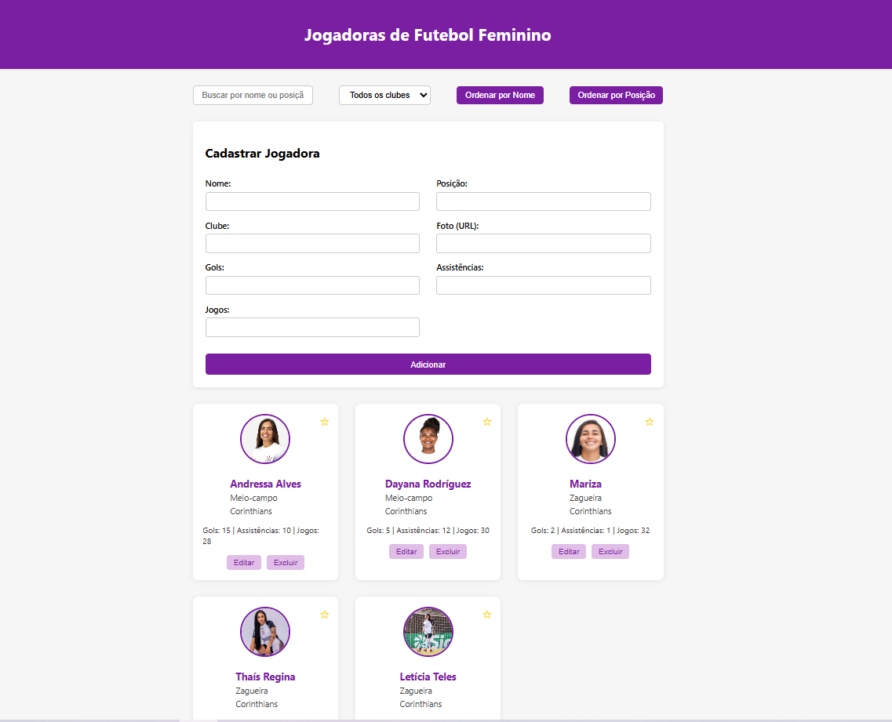

# ⚽ Gerenciador de Jogadoras de Futebol Feminino

> Uma aplicação web para gerenciar jogadoras de futebol feminino de forma simples, bonita e interativa!

---

## ✨ Funcionalidades

🔹 **Listagem:** Cards com foto, nome, posição, clube e estatísticas.
🔹 **Favoritar:** Marque suas jogadoras favoritas com ⭐.
🔹 **Cadastro:** Adicione novas jogadoras facilmente.
🔹 **Edição:** Atualize dados e fotos das jogadoras.
🔹 **Remoção:** Exclua jogadoras da lista.
🔹 **Busca:** Encontre jogadoras por nome ou posição.
🔹 **Filtro:** Filtre por clube.
🔹 **Ordenação:** Ordene por nome ou posição.

---

## 🛠️ Tecnologias Utilizadas


---

## 🚀 Como Rodar

1. Clone este repositório ou baixe os arquivos.
2. Abra o arquivo `index.html` em seu navegador preferido.
3. Pronto! Não precisa de servidor ou backend.

---


## 🌐 Acesse o Site

[https://gabsgc01.github.io/CP4-WEB-DEV/](https://gabsgc01.github.io/CP4-WEB-DEV/)

---

## 📁 Estrutura dos Arquivos

```
├── index.html      # Estrutura da página
├── style.css       # Estilos visuais
├── app.js          # Lógica da aplicação
```

---

## 💡 Observações

- Os dados são salvos automaticamente no LocalStorage do navegador.
- As imagens das jogadoras são URLs fictícias, substitua por imagens reais se quiser.
- 100% responsivo e pronto para usar!

---

## 👩‍💻 Demonstração




---


## 👨 Integrantes do Grupo

- Gabriel Ciriaco RM:564880

---

Feito com 💜 para fins educacionais e de demonstração.
